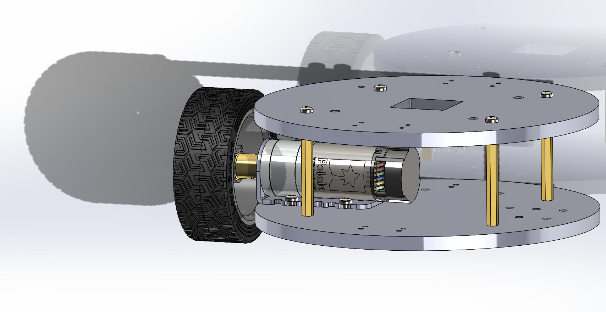

# CMU 16704

Course project repository for CMU 16704.

## Project Structure

```
cmu_16704/
├── hw3/
│   ├── q4_a/
│   │   ├── car_top.SLDPRT
│   │   └── q4_a.png
│   └── q4_b/
│       ├── car_bottom.SLDPRT
│       ├── car_top.SLDPRT
│       ├── q4_b.png
│       └── q4_b.SLDASM
├── hw4/
│   ├── p1/   (p1.ino)
│   ├── p2/   (p2.ino)
│   ├── p3-1.hex, p3-2.hex
│   ├── p4/   (p4.ino)
│   ├── p5/   (p5.ino)
│   ├── p6.txt, p7.txt
│   └── p8/   (p8.ino)
└── README.md
```

## Images

### Homework 3 (hw3)

#### Question 4a (q4_a)


#### Question 4b (q4_b)


## Homework 4 (hw4)

Arduino/lab assignments: `p1`–`p8` (`.ino` sketches, `.hex` files, and `p6.txt` / `p7.txt`).